# Kinolab — user manual

**Files live in Drive. Decisions live here.**

Kinolab is where an AI-native production keeps its record: which options
existed, which one was picked, who approved it, and when. The images can be
generated anywhere — Midjourney, Runway, Nano Banana, a paint-over in
Photoshop. What Kinolab holds is the decision trail around them.

This manual is written for the people using the software day to day, artists
first. Producer-facing screens are covered further down. Version 1.2.

---

## Contents

1. [Signing in](#1-signing-in)
2. [My work — your screen](#2-my-work--your-screen)
3. [A shot, up close](#3-a-shot-up-close)
4. [Adding options](#4-adding-options)
5. [The Review Room](#5-the-review-room)
6. [Characters](#6-characters)
7. [Keyboard shortcuts](#7-keyboard-shortcuts)
8. [For producers](#8-for-producers)
9. [Who can do what](#9-who-can-do-what)
10. [When something looks wrong](#10-when-something-looks-wrong)

---

## 1. Signing in

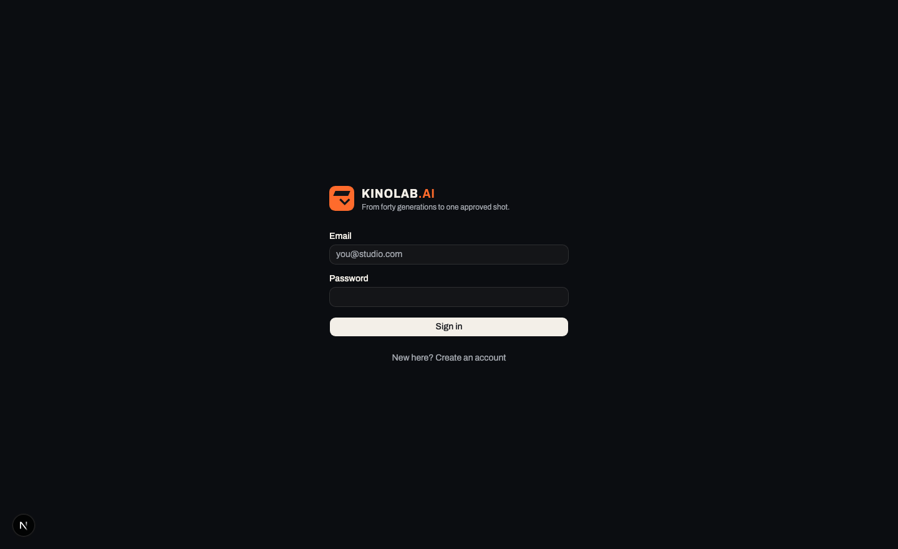

Sign in with the email address your producer invited. Accounts are
invite-only: registering with an address nobody has invited will not create
one.

After signing in you land on **Productions** — every production in your
studio, with a bar showing how its shots are spread across statuses.

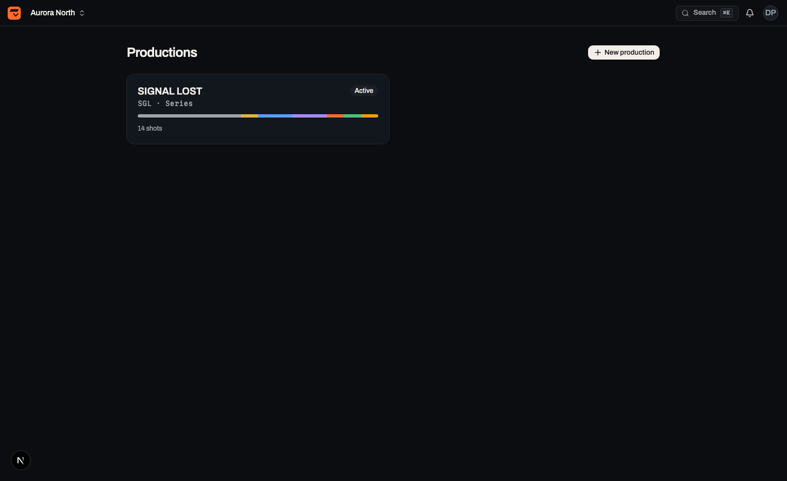

Open one and you are in the production, with the rail on the left. The rail is
the same everywhere: **My work** first, then the production-wide screens.

> **Appearance.** Kinolab opens dark. Light ("production office") is under
> **Settings → Appearance** and is remembered per device. The Review Room
> stays dark whatever you choose — you cannot judge colour against a bright
> surround.

---

## 2. My work — your screen

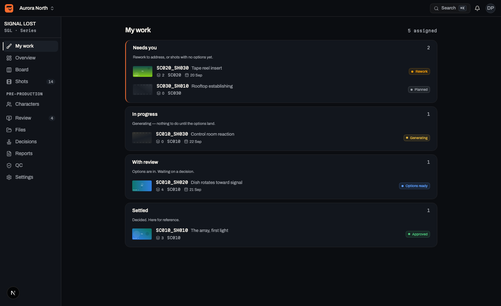

Every other screen answers *how is the production doing*. This one answers
*what is on me*. Your assigned shots, grouped by whose move it is:

| Section | What it means |
|---|---|
| **Needs you** | Rework to address, or a shot with no options yet. Your move. |
| **In progress** | Marked generating. Nothing to do until the options land. |
| **With review** | Your options are in. Someone else owes a decision. |
| **Settled** | Picked, approved or delivered. Here for reference. |

Inside **Needs you**, rework comes before never-started work — someone is
already waiting on that second pass — and then by due date. A due date turns
red only once it has actually passed.

Each row shows the frame, the shot code, how many options exist, the scene and
the due date. Click anywhere on it to open the shot.

> **Nothing here?** That is normal on your first day. Shots appear the moment
> a producer puts your name on one. Ask, or browse **Shots** to see the whole
> production.

---

## 3. A shot, up close

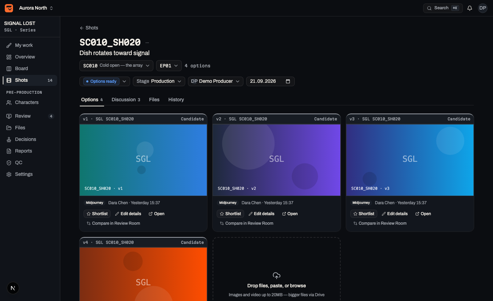

The heading is the shot code, then its title. Under it: the scene, the
episode, and the option count. The row of controls sets **status**, **stage**,
**assignee** and **due date** — as an artist you can change these on shots
assigned to you, within the working statuses.

Four tabs:

- **Options** — every version uploaded for this shot. This is where you work.
- **Discussion** — comments. Type `@` to mention someone; they get a
  notification that links straight back here.
- **Files** — everything attached to the shot, including non-option files.
- **History** — who did what, in order. Nothing is ever silently overwritten.

Each option card carries its **generation details**: tool, model, seed and the
prompt. Fill these in — they are what makes a result repeatable six weeks
later, and they end up in the provenance export.

---

## 4. Adding options

On the **Options** tab, the last card is the uploader. Three ways in, all
equivalent:

- **Drop** files onto it.
- **Paste** — copy an image anywhere and press `⌘V` with the shot open.
- **Browse** — click and pick files.

Images and video up to 20MB go straight into Kinolab. Bigger files belong in
Drive and get attached from there.

Each upload becomes the next version — `v1`, `v2`, `v3` — and versions are
never renumbered or replaced. A better take is a new version, not an edit of
the old one.

**Shortlist** (the star) marks the ones worth comparing. Shortlisting is not
deciding — it just gathers candidates so the Review Room can put them
side by side.

---

## 5. The Review Room

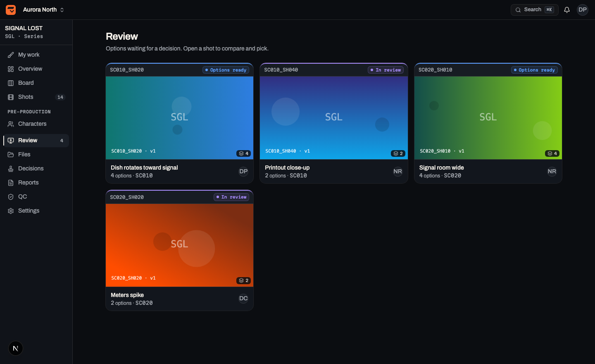

**Review** lists every shot with options waiting on a decision. Open one and
the room takes the whole screen.

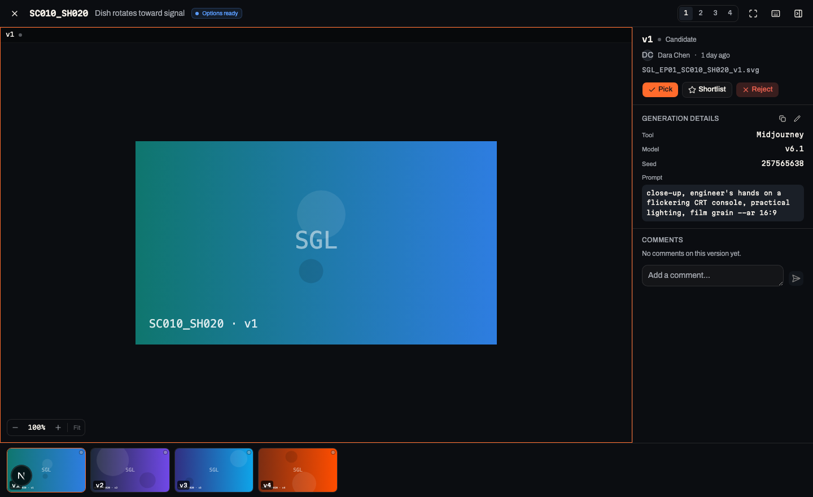

The right rail shows the focused version: who made it, the filename, the
generation details, and the comment thread for that specific version.

### Comparing

Press `1`, `2`, `3` or `4` to put that many options on screen at once. Zoom and
pan are **shared across every pane**, so the same detail stays aligned — which
is the entire point when you are checking whether the hands survived.

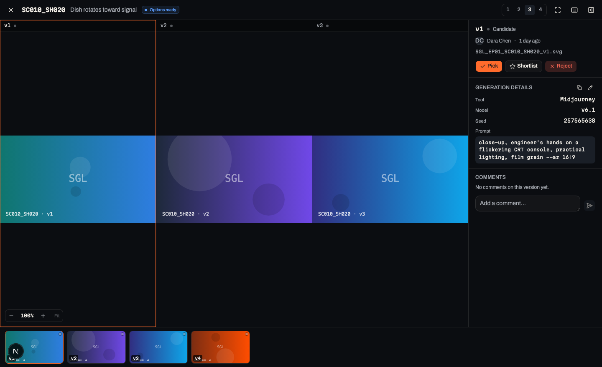

If you have shortlisted at least as many options as panes, the room shows the
shortlist. Otherwise it walks the versions from wherever your focus is.

### Zoom

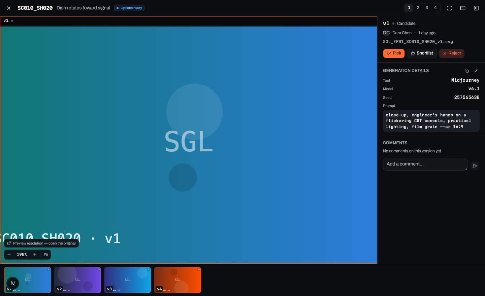

Bottom left: `−`, the current zoom, `+`, and **Fit**.

- Scroll to zoom toward the cursor, drag to pan, double-click to reset.
- `−` and `+` zoom from the keyboard, `0` returns to Fit.
- The percentage is relative to **fit**, not to the image's own pixels — with
  up to four differently sized images sharing one transform, there is no
  single "100% of original" to show.

> **Past about 175% you are looking at the preview, not the original.** The
> room draws a cached thumbnail so that four panes stay responsive. Once you
> zoom past that, a link appears — **open the original** — and that is what
> you should judge fine detail on. Do not reject a shot for soft fingers
> without checking there first.

### Deciding

| Key | Does |
|---|---|
| `S` | Shortlist / unshortlist the focused version |
| `X` | Reject it — asks for a reason |
| `P` | Pick it — the decision |
| `←` `→` | Move focus |
| `F` | Fullscreen |
| `Esc` | Back to the queue |

**A pick is the decision.** One version per shot, recorded with who picked it
and why, and copied into the Drive `Approved/` folder under its canonical
name. Picking a different version later supersedes the first — both stay in
the record. Rejections keep their reason.

Only Creative Directors, Producers, Supervisors (within their stages) and
Owners can pick. Artists and Viewers can comment and shortlist.

---

## 6. Characters

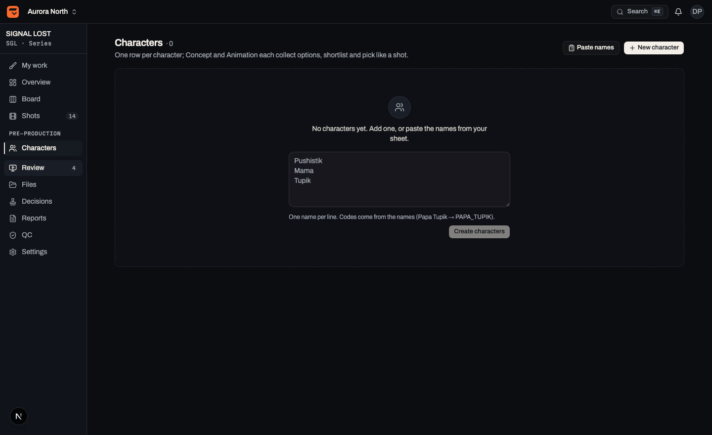

Characters work the same way as shots, one row per character, with a phase for
**Concept** and one for **Animation**. Each phase has its own options, its own
pick and its own status — the same options-and-pick loop, so nothing new to
learn.

The **Prompt** column holds the character's base prompt. Edit it inline, copy
it with one click, and build each generation on top of it so a character stays
recognisable across shots.

---

## 7. Keyboard shortcuts

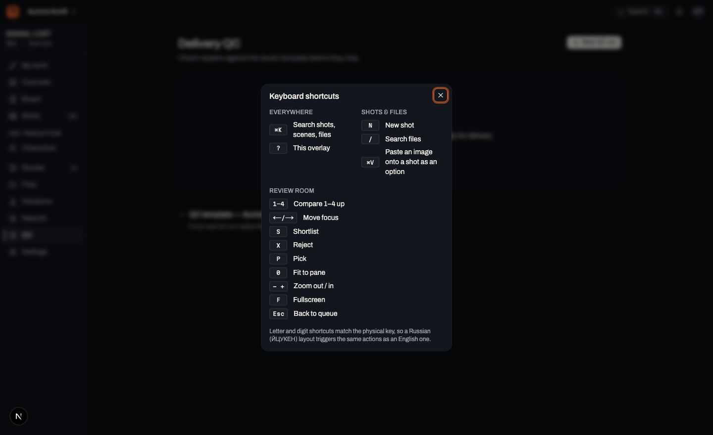

Press `?` anywhere for this list. `⌘K` searches shots, scenes and files.

Letter and digit shortcuts follow the **physical key**, so a Russian (ЙЦУКЕН)
layout triggers the same actions as an English one.

---

## 8. For producers

**Overview** — the production in one screen: how far it has got, what needs
you, the stage pipeline with its gates, and the picked frames so far.

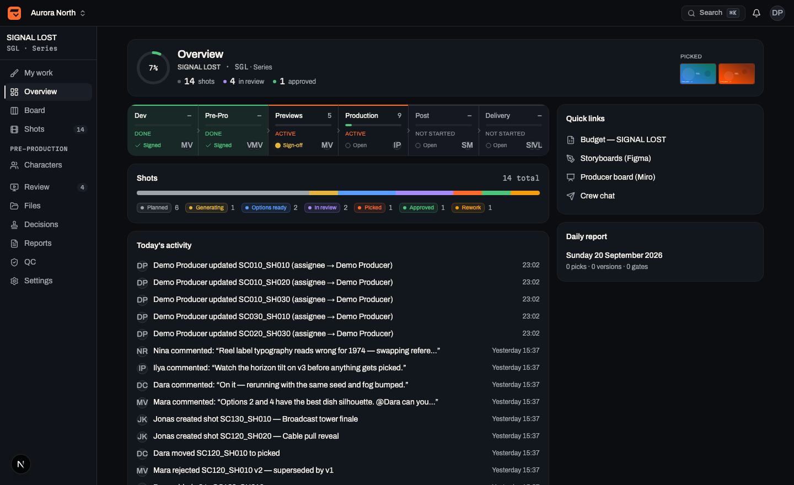

**Board** — shots across the six stages. Drag between columns; edit status,
assignee and due date on the card itself. Each stage has a **gate**: request
sign-off, approve, or reject with a note.

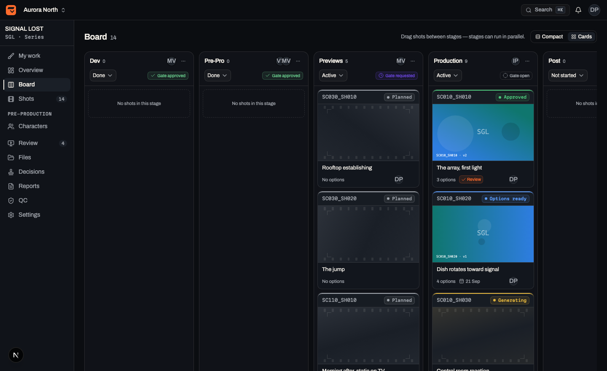

**Shots** — the whole list, filterable by status, stage, scene, assignee and
episode. Switch between table and grid with the toggle; press `N` to add
shots, either by naming a scene and generating numbered shots, or by pasting a
list from your sheet.

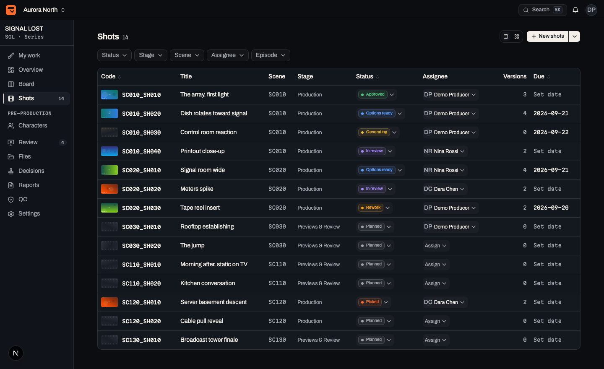
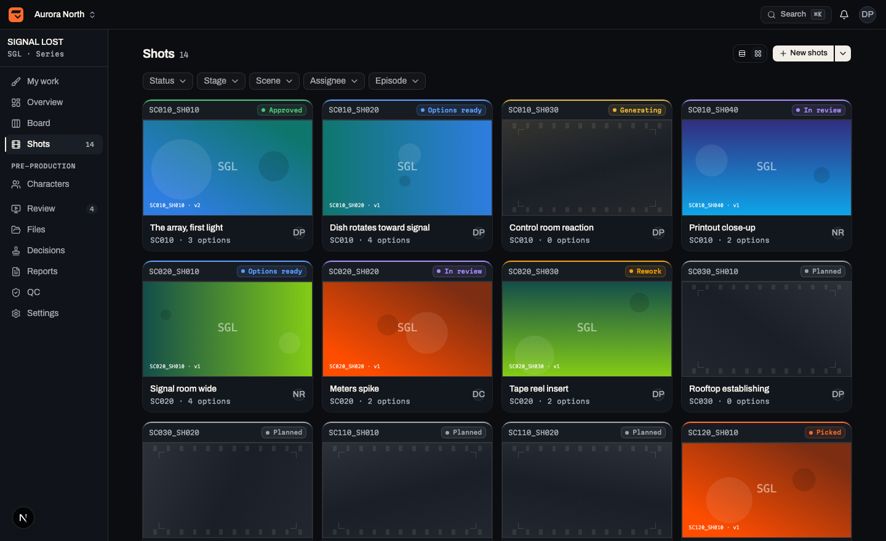

**Decisions** — the ledger. Every gate, pick and QC sign-off, in order, with
who and why. Exportable as CSV, and as a **provenance export** carrying every
prompt, seed, file identity and decision.

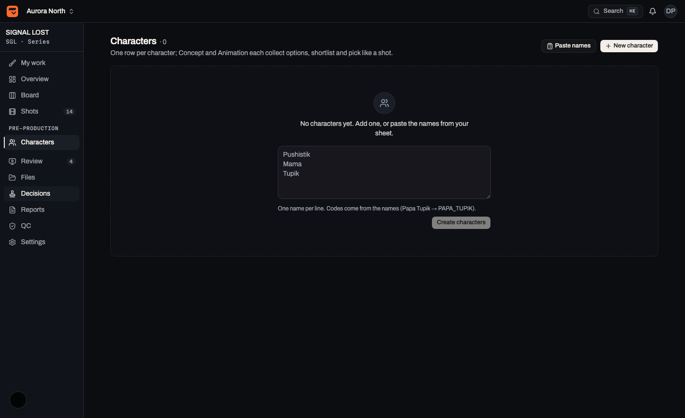

**Reports** — the day compiled at 18:00, or generated on demand. Publishing
freezes it and notifies the team.

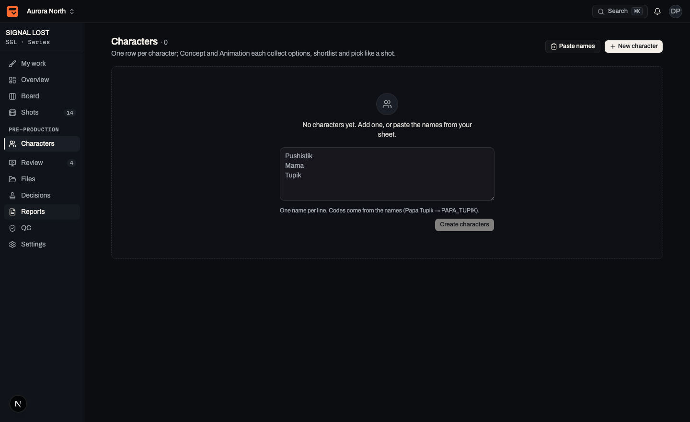

**QC** — delivery checklists against a template, per master.

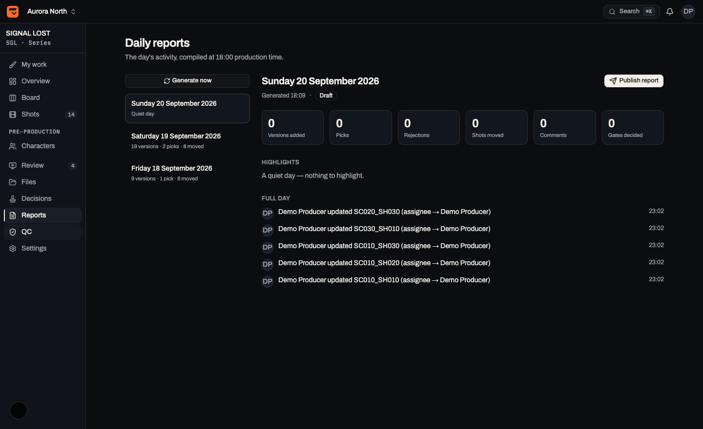

---

## 9. Who can do what

| Role | Can |
|---|---|
| **Owner** | Everything, including studio settings |
| **Producer** | Configure productions, manage members, approve anything |
| **Creative Director** | Approve gates and picks anywhere |
| **Supervisor** | Edit content, run QC, decide within assigned stages |
| **Artist** | Create versions, comment, move their own shots |
| **Viewer** | Read and comment |

Every action is checked on the server, not just hidden in the interface, and
every one writes a line of history.

---

## 10. When something looks wrong

**A thumbnail is blank.** The file's bytes are missing from storage — the row
survived a restore that did not carry the blobs. Re-upload it.

**"Drive connection expired."** Reconnect under **Settings → Drive hub**. Picks
keep working; only the filing into `Approved/` pauses.

**A decision was wrong.** Nothing is deleted. Pick another version — it
supersedes the first, and both stay in the ledger with their reasons.

**The screen looks stale.** Kinolab is realtime; boards, queues and gate chips
update without a refresh. If one does not, reload — and tell whoever runs
your pilot, because that is a bug worth knowing about.
